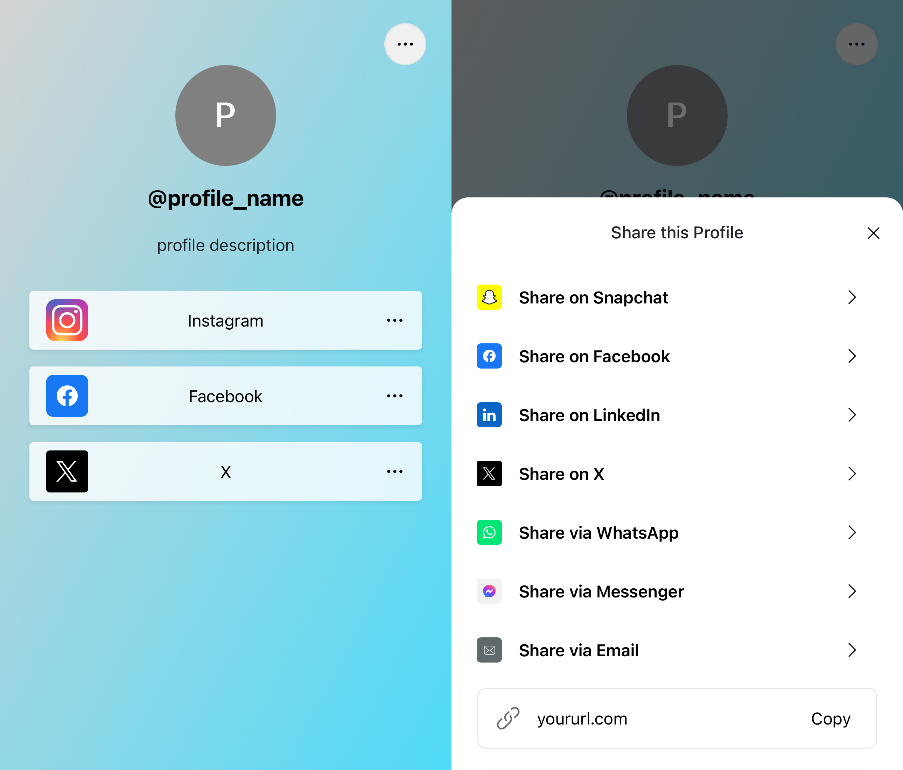

# LinqFree

> Free Full-Stack and Quickly-Deployable Linktree Alternative



## Features
- Unlimited Customization
- Social Icons
- Custom Data Analytics
- SEO Friendly
- Share Links

## Installation and Running
1. [Download]([Download Latest Release](https://github.com/jecharlt/LinqFree/archive/refs/tags/1.07.zip)
   ) the latest release `.zip` file to your local machine or clone the repo:
      ```bash
      git clone https://github.com/jecharlt/LinqFree.git
      ```


2. Install dependencies:
    ```bash
    composer install
    npm install
    ```


3. Configure env:
   - Rename `.env.example` to `.env` and configure the variables as necessary


4. Generate Laravel application key:
    ```bash
    php artisan key:generate
    ```


5. Serve the application:
    ```bash
    php artisan serve
    ```


6. Compile front-end:
    ```bash
    npm run dev
    ```

## Customization
Quickly customize pre-defined variables (profile name, links, background, etc.), by visiting `config\display.php`

## Security Vulnerabilities
If you discover a security vulnerability within LinqFree, please email John Charlton via [53029902b@gmail.com](mailto:53029902b@gmail.com)

## Credits
- [John Charlton](https://github.com/jecharlt)

## License
The MIT License (MIT). Please see [License File](LICENSE.md) for more information. 


